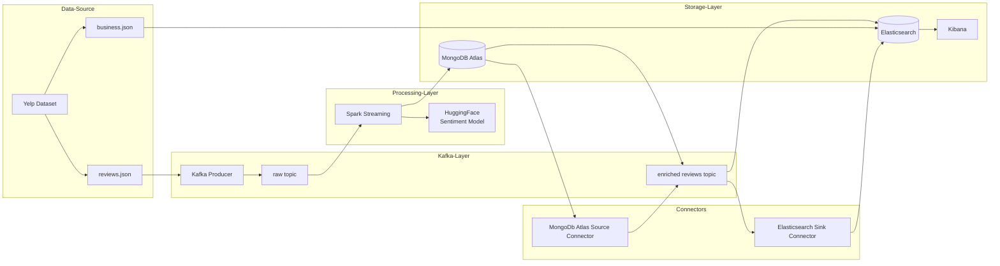

# Project Overview

This project sets up a real-time sentiment analysis system for Yelp reviews using various technologies like Kafka, Spark, MongoDB, Hugging Face, Elasticsearch, and Kibana. It ingests raw review data from the Yelp dataset on Kaggle, enriches it with sentiment analysis, and visualizes the results in real time, providing insights into customer feedback. The project utilizes a multi-step process involving data ingestion, processing, enrichment, indexing, and visualization.

## Business Objectives
- **Real-time Customer Sentiment Monitoring**: The pipeline allows for tracking customer sentiment towards businesses as reviews are posted. This real-time monitoring helps businesses understand customer perceptions immediately.

- **Proactive Response to Negative Feedback**: By identifying negative reviews quickly, businesses can proactively address customer concerns and potentially mitigate negative publicity.

- **Improved Customer Experience**:  Insights from sentiment analysis can help businesses identify areas for improvement, ultimately leading to a better customer experience.

- **Data-Driven Decision Making**: The real-time data and visualizations enable data-driven decision making for marketing strategies, customer service improvements, and overall business operations.

## Key Features
- **Real-time Processing**: The system processes and analyzes data as it arrives, enabling immediate insights and actions based on the sentiment of incoming reviews.

- **Sentiment Analysis Integration**: The pipeline utilizes a Hugging Face DistilBERT model to perform sentiment analysis on Yelp reviews, automatically classifying reviews as positive or negative.

- **Scalability and Reliability**:  By leveraging technologies like Kafka and Spark, the system can handle large volumes of data and ensure continuous operation even with interruptions.

- **Interactive Visualizations**: Kibana dashboards provide interactive visualizations of the sentiment data, allowing users to explore trends, patterns, and individual reviews.

- **Flexible Data Pipeline**: The modular design of the pipeline allows for customization and integration with other data sources or analysis tools

## Technical Stack Summary
- **Python**: Used to develop the Kafka producer, Spark stream processor, and data analysis scripts.
- **Confluent Kafka**: A distributed streaming platform for handling real-time data streams.

- **Apache Spark**: A data processing engine used for large-scale data processing and streaming.

- **MongoDB Atlas**: A cloud-based database service for storing enriched data.

- **Hugging Face**: A platform providing pre-trained machine learning models, including the DistilBERT model for sentiment analysis.

- **Elasticsearch**: A distributed search and analytics engine for indexing and querying data.

- **Kibana**: A data visualization and exploration tool for creating interactive dashboards.

# System Architecture

## Architecture Diagram


- **Ingestion from Yelp Dataset:**
    - The system begins by ingesting data from the Yelp dataset hosted on Kaggle.
    - A Kafka Producer, written in Python, reads the "reviews.json" file line by line.
    - Each line, representing a Yelp review, is decoded from JSON format.
    - The Producer sends each review as a message to a Kafka topic named "raw topic".
    - The Producer includes error handling for JSON decoding issues and implements a checkpointing mechanism to ensure data integrity and resume processing from the last successfully sent message in case of interruptions.

- **Real-time Streaming and Enrichment with Spark:**
    - Apache Spark Streaming is used to process the incoming data in real time.
    - Spark reads the raw review data from the "raw topic" Kafka topic.
    - A predefined schema ensures that the incoming Kafka messages have a consistent structure, containing fields like review ID, user ID, business ID, star rating, review text, and date.
    - Spark enriches the streaming data by adding a new column called "sentiment".
    - This sentiment classification is performed using a pre-trained Hugging Face sentiment analysis model ("DistilBERT Base Uncased finetuned SST2 English").
    - The model analyzes the text of each review and classifies it as either "positive" or "negative".
- **Storage in MongoDB**:
    - Spark writes the enriched data, now containing the sentiment label, to a MongoDB database.
    - The data is stored in a database named "reviewsDB" and a collection named "enriched_reviews_collection".
    - MongoDB serves as .
- **Data Transfer from MongoDB to Kafka**:
    - A MongoDB Source Connector in Confluent is used to transfer the data from MongoDB to another Kafka topic.
    - This connector reads the data from the "reviewsDB.enriched_reviews_collection" in MongoDB.
    - It sends the data to a Kafka topic named "reviewsDB.enriched_reviews_collection," mirroring the MongoDB collection name.
    - During this transfer, the connector performs several transformations:
        - It moves the "reviewID" field to the key of the Kafka message for efficient lookups.
        - It removes the MongoDB-specific "_id" field.
- **Final Processing and Indexing in Elasticsearch**:
    - An Elasticsearch Sink Connector in Confluent is responsible for ingesting the data from the "reviewsDB.enriched_reviews_collection" Kafka topic and sending it to Elasticsearch.
    - Before the data reaches Elasticsearch, several steps are taken to further process and enrich it:
        - Index Creation: An Elasticsearch index named "reviews" is created to store the enriched review data. This index has a predefined schema designed to accommodate the enriched data.
        - Enrichment Policy: An enrichment policy is created in Elasticsearch to extract relevant fields from a separate "businesses" index (populated earlier from the "business.json" data) and add them to the incoming review data. This process adds business details to each review record.
    - Ingestion Pipeline: An ingestion pipeline is set up in Elasticsearch, which uses the enrichment policy to enrich the incoming review data on the fly. This pipeline ensures that the review data is enriched with business information as it is ingested into the "reviews" index.
    - The Elasticsearch Sink Connector, configured to use the "reviews" index and the ingestion pipeline, efficiently indexes the enriched review data.

The data, originating from the Yelp dataset, undergoes a series of transformations as it passes through Kafka, Spark, MongoDB, and finally reaches Elasticsearch. This carefully orchestrated pipeline ensures that the data is cleaned, enriched, and properly indexed for real-time analysis and visualization in Kibana.

## System Components

### Data Source (Yelp Dataset)
The system's primary data source is the Yelp dataset hosted on [Kaggle](https://www.kaggle.com/datasets/yelp-dataset/yelp-dataset). This dataset comprises multiple files, including "business.json" which contains information about businesses (business ID, name, address, etc.), and "reviews.json," which contains the reviews themselves.

#### Alternatives:

- If real-time review data were accessible directly from Yelp's API, it could be used instead of static Kaggle data.
- Other social media APIs, such as Twitter, could also provide real-time user sentiment data.

### Kafka (Confluent)
Kafka acts as the backbone for real-time data streaming within the system. It facilitates the movement of data between different components, ensuring a smooth and continuous flow of information. It serves as the central messaging backbone for data flow between components.


A Kafka Producer handles data ingestion by reading the "reviews.json" file and sends raw reviews to a Kafka topic named "raw topic" while ensuring message reliability through checkpointing. A schema is defined for the "raw topic" to ensure data consistency before processing.


1. Environment Setup:
    -  Install necessary libraries: confluent_kafka and pandas. `!pip install confluent_kafka`
    - Set up Kafka producer configuration: Define a dictionary called conf to store settings like bootstrap.servers (Kafka cluster address), security.protocol, sasl.mechanisms, sasl.username, sasl.password, and client.id. These settings ensure secure communication and authentication with the Kafka cluster.
        ```python
        conf = {
            "bootstrap.servers":CONFLUENT_BOOTSTRAP_SERVER,
            "security.protocol":"SASL_SSL",
            "sasl.mechanisms":"PLAIN",
            "sasl.username":CONFLUENT_API_KEY,
            "sasl.password":CONFLUENT_API_SECRET,
            "client.id":"json-serial-producer"
        }
        ```
    - Create a Kafka producer instance: Initialize a Producer object using the conf dictionary. `producer = Producer(conf)`
    - Define the topic name: Assign the variable topic to the string "raw_topic", representing the Kafka topic where raw reviews will be sent `topic = "raw_topic"`
2. Data Ingestion and Message Sending:
    - Read the "reviews.json" file: The stream_json_serially function opens the specified JSON file for reading.
    - Iterate through each review: The function iterates through each line of the file, representing a single review.
    - Deserialize JSON data: For each line, the json.loads function is used to convert the JSON string into a Python dictionary.
    - Send the message to Kafka: The producer.produce method is called with the following arguments:
        -  topic: The name of the Kafka topic ("raw_topic").
        -  key: The review ID (record['review_id']) is used as the message key.
        -  value: The entire review record is serialized back into a JSON string using json.dumps and encoded in UTF-8.
        -  callback: The delivery_report function is set as a callback to handle delivery confirmations or errors.
3. Message Reliability with Checkpointing:
    - Implement checkpointing: The read_checkpoint and write_checkpoint functions are used to read and write the last successfully processed message index to a checkpoint file.
    - Read checkpoint on startup: At the beginning of the process, the read_checkpoint function retrieves the last sent index from the checkpoint file, indicating where to resume processing if interrupted.
    - Update checkpoint after sending: After successfully sending a message to Kafka and receiving confirmation, the write_checkpoint function updates the checkpoint file with the current index.
4. Data Consistency with Schema:
    - Define Avro schema for "raw_topic": A schema is defined for the "raw_topic" using Avro, ensuring data consistency by specifying the expected data types and structure for each review.
    - Schema enforcement: While the code doesn't explicitly show schema enforcement, the Confluent platform allows you to set up schema validation for Kafka topics. This means that any message produced to the "raw_topic" that doesn't adhere to the defined Avro schema would be rejected, ensuring data consistency before further processing.
5. Handling Date Formats:
    - handle_date function: This function specifically handles dates within the JSON records by converting pandas.Timestamp objects to a string format before serialization. This ensures proper handling of date data types and prevents errors during JSON serialization.
6. Execution and Verification:
    - Run the stream_json_serially function: This initiates the data ingestion and message sending process.
    - Monitor the "raw_topic" on Confluent Cloud: You can verify the successful flow of data by monitoring the "raw_topic" on the Confluent Cloud platform. The messages tab will show the incoming messages from the producer, allowing you to confirm that the data is being streamed in real-time and adheres to the defined schema.


Reviews Topic for Enriched Data: Receives data after it’s enriched with sentiment labels, making it available for downstream analytics.


### Spark (PySpark)

Apache Spark is used for real-time data processing. Spark reads the raw review data from the "raw topic" Kafka topic then enriches this data by using a Hugging Face sentiment analysis model ("DistilBERT Base Uncased finetuned SST2 English") to classify each review as positive or negative.
- The read_from_kafka_and_write_to_mongo() function sets up a Spark structured streaming job.
- Within the function, it defines the Kafka configuration with parameters such as the server address, topic, and security protocol.
- The function reads streaming data from the Kafka topic.
- Then, it applies a schema to parse the binary data into a structured DataFrame.
- Next, the sentiment of each review is analyzed.
- A Hugging Face pipeline, pretrained on sentiment analysis, is used to classify the sentiment.
- The pipeline returns a sentiment label such as "positive" or "negative".
- Finally, the function writes this enriched DataFrame, containing both original review data and sentiment, to a MongoDB collection.
- The code ensures the stream can be restarted from where it left off using checkpoints, a feature of Spark structured streaming.

### MongoDB (Atlas)
MongoDB collects the enriched data from Spark Streaming. This accumulation allows for a controlled flow of data to Elasticsearch. MongoDB helps regulate the data stream, ensuring Elasticsearch isn't overwhelmed by a sudden influx of data from Spark. The presence of MongoDB decouples Spark's data processing from Elasticsearch's indexing, allowing each system to operate at its own pace. 

However the main purpose of using MongoDB is for Archival, Backup, and  for Interfacing with Other Applications ( allow other apps to access enriched review data for secondary purposes without querying Elasticsearch).

### MongoDB Source Connector
- **Connector Configuration**: Create a MongoDB Atlas Source connector in Confluent Cloud to stream data from the MongoDB database to a new Kafka topic named reviews_db.enriched_reviews_collection.
- **Data Transformation**: Configure the connector to perform transformations like moving the reviewID field to the key of the Kafka message, removing the _id field, and ensuring data is serialized in JSON format.


### Elasticsearch
Elasticsearch is used for indexing and analyzing the enriched data.
- An Elasticsearch Sink Connector in Confluent pulls data from the "reviewsDB.enriched_reviews_collection" Kafka topic and pushes it to a new Elasticsearch index.
```
PUT /reviewsdb.enriched_reviews_collection
{
  "mappings": {
    "properties": {
      "date": {
        "type": "date",
        "format": "yyyy-MM-dd HH:mm:ss"
      },
      "business_id": {
        "type": "keyword"
      },
      "review_id": {
        "type": "keyword"
      },
      "sentiment": {
        "type": "keyword"
      },
      "business": {
        "type": "object",
        "properties": {
          "name": {
            "type": "keyword"
          },
          "city": {
            "type": "keyword"
          },
          "categories": {
            "type": "text"
          },
          "geo_location": {
            "type": "geo_point"
          }
        }
      },
      "user_id": {
        "type": "keyword"
      },
      "cool": {
        "type": "integer"
      },
      "stars": {
        "type": "float"
      },
      "text": {
        "type": "text"
      },
      "useful": {
        "type": "integer"
      },
      "funny": {
        "type": "integer"
      }
    }
  }
}
```
- An enrichment policy in Elasticsearch is created to extract information like business name, city, and geo-location from a "businesses" index (created from the "business.json" data). The policy matches records based on a common field called “business_id”.
```
PUT /_enrich/policy/business_policy
{
  "match": {
    "indices": "businesses",
    "match_field": "business_id",
    "enrich_fields": [
      "name",
      "latitude",
      "longitude",
      "city",
      "categories"
    ]
  }
}
```
- Then, the enrichment policy is executed from from Index Management -> Enrich Policies Section to apply it to the reviews data
- An ingestion pipeline in Elasticsearch (“enrich_reviews_pipeline”) is set up to process incoming data from Kafka before it is stored in Elasticsearch. This pipeline uses the previously created enrichment policy to add business data to reviews. The ingestion pipeline also combines the “latitude” and “longitude” fields into a new “geo_location” field, which is more suitable for geographical analysis. Afterwards, it removes the individual latitude and longitude fields.
```
PUT /_ingest/pipeline/enrich_reviews_pipeline
{
  "processors": [
    {
      "enrich": {
        "field": "business_id",
        "policy_name": "business_policy",
        "target_field": "business"
      }
    },
    {
      "script": {
        "source": "ctx.business.geo_location = ['lat': ctx.business.latitude, 'lon': ctx.business.longitude];"
      }
    },
    {
      "remove": {
        "field": ["business.latitude", "business.longitude"]
      }
    }
  ]
}
```

-  The ingestion pipeline is set as the default pipeline for the reviews index so that any data entering the index is automatically enriched

```
PUT /reviewsdb.enriched_reviews_collection/_settings
{
  "index": {
    "default_pipeline": "enrich_reviews_pipeline"
  }
}
```

### Kibana
Kibana is used for real-time visualization of the data stored in Elasticsearch.

- First, navigate to the Analytics section in Kibana and select Dashboards. Then create a new dashboard.
- Create a donut visualization using the sentiment field to show the proportion of positive and negative reviews.
- Next, create a metric visualization showing the total number of reviews using the review_id field.
- Then create an average metric visualization of the stars field to see the average star rating.
- A map visualization can be created using the business.geo_location field to show the geographical distribution of the reviews.
- Create a tag cloud visualization using the business.city field to see which cities have the most reviews. Disable the “group remaining values as other” option in the advanced settings to show all cities.
- Create another tag cloud using the business.name field to see which businesses have the most reviews. Also, disable the grouping of remaining values.
- Use the review_id field to create a table visualization that displays the top five reviewers. Again, disable the “other” grouping.
- Create a horizontal stacked bar visualization to see the distribution of stars ratings across different levels of cool, funny, and useful scores.
- Finally, create a line graph using the date field to see how the volume of reviews changes over time. Adjust the horizontal axis to show weekly intervals and unbind it from the global time filter.
- Save the entire dashboard and give it a name.
- The dashboard will continue to update in real time, allowing you to explore the data and gain insights into the sentiment, geographical distribution, and trends of the Yelp reviews.

## Conclusion
This architecture provides a robust setup for real-time sentiment analysis, leveraging Kafka for reliable messaging, Spark for enrichment, MongoDB and Elasticsearch for storage and indexing, and Kibana for visualization. While alternatives exist, the chosen stack combines scalability, performance, and fault tolerance for efficient real-time data processing.